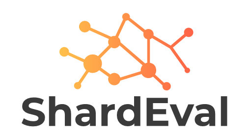
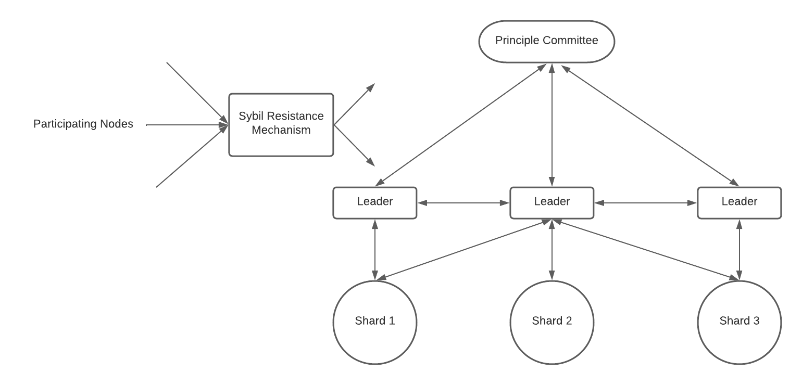
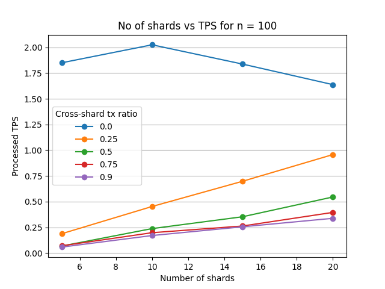

## Basic Overview
ShardEval is a **sharding based blockchain simulator**. It is built on the top of [BlockEval](https://github.com/deepakgouda/BlockEval). More about the algorithm and simulator can be found here in this [doc](https://docs.google.com/document/d/1rB9lp8E5DQ6BXFdl3mfWjlItKq1i_78THTsPUrD1aXc/edit#).



## Setup
```bash
cd ShardEval
pip install -r requirements.txt
```

## Usage 

### Execution of the Simulator
The simulator can be executed in 2 ways -
1. Using ```simulate.py``` to generate a single log file

    ```bash
    mkdir simulation_logs
    python simulate.py
    ```

2. Using ```script.py``` to generate log files in bulk

    ```bash
    mkdir simulation_logs
    python script.py
    ```

    The script files need to be modified suitably to generate logs with suitable parameters. The parameters can be modified fron the ```config/params.json``` file.

**Note:** To generate detailed logs, set ```verbose``` to 1 in the ```params.json``` file.


### Output from the Simulator
Upon executing the simulator, log file(s) containing the simulation results and entire lifecycle of the simulation will be generated.  
In case of ```simulate.py```, the log file will be named as ```simulation_results.log```, while in case of ```script.py```, more elaborate naming convention is followed and logs fils are stored in a directory structure representing current dare and time.

Example -

```
...
693.1657 : Node FN3 received a Final-block - B_FN11_31a7db44-ca47-4899-b078-82601fee8aeb from FN8
693.1657 : Node FN3 propagated Block B_FN11_31a7db44-ca47-4899-b078-82601fee8aeb to its neighbours ['FN8']
693.1665 : Node FN8 received a Final-block - B_FN11_31a7db44-ca47-4899-b078-82601fee8aeb from FN3
693.2447 : T_FN8_68c3437f-f6e3-4486-8d05-6ae26bf017f2 added to tx-pool of ['FN14']
...
719.8211 : T_FN12_a929b89a-3cf6-4707-af03-00b35500f8d4 added to tx-pool of ['FN10']
719.8211 : T_FN12_a929b89a-3cf6-4707-af03-00b35500f8d4 accepted by FN10
719.8226 : Node FN13 (Leader) received voted Cross-shard-block CB_FN10_0f76c779-d5f1-426d-b5c3-ca7adf928aa7 but it didn't originate in its own shard
719.8226 : Node FN13 propagated Voted-Cross-shard-block CB_FN10_0f76c779-d5f1-426d-b5c3-ca7adf928aa7 to its neighbours ['FN10']
719.8226 : Node FN13 received a Tx-block - TB_FN13_2077c41a-97a7-445f-be37-629ba6297036 from FN1
...

============  SIMULATION DETAILS  ============

Number of nodes = 15
Number of shards = 3
Fraction of cross-shard tx = 0.2
Simulation Time = 0.2716028690338135 seconds

Length of Blockchain = 8
Total no of transactions included in Blockchain = 132
Total no of intra-shard transactions included in Blockchain = 82
Total no of cross-shard transactions included in Blockchain = 50

Total no of transactions processed = 440
Total no of intra-shard transactions processed = 370
Total no of cross-shard transactions processed = 70

Total no of transactions generated = 525
Total no of intra-shard transactions generated = 412
Total no of cross-shard transactions generated = 113

Processed TPS = 0.22
Accepted TPS = 0.066
...
```

### Analysis of the Logs
Upon execution, several files (html, txt, csv, png) will be created in respective folders inside the ```logs_data```.   

To analyse the generated log file -
```bash
mkdir logs_data/interactive_plots logs_data/metadata logs_data/plots logs_data/summary
python analyzer/log_analyzer.py <log_file>
```

To generate the summary of the generated log files present in a directory -
```bash
mkdir logs_data/summary
python analyzer/log_summarizer.py <directory_name>
```

To generate plots from the summary of the logs -
```bash
mkdir logs_data/plots
python analyzer/visualizer.py logs_data/summary/<summary_file>.csv
```

Example -

